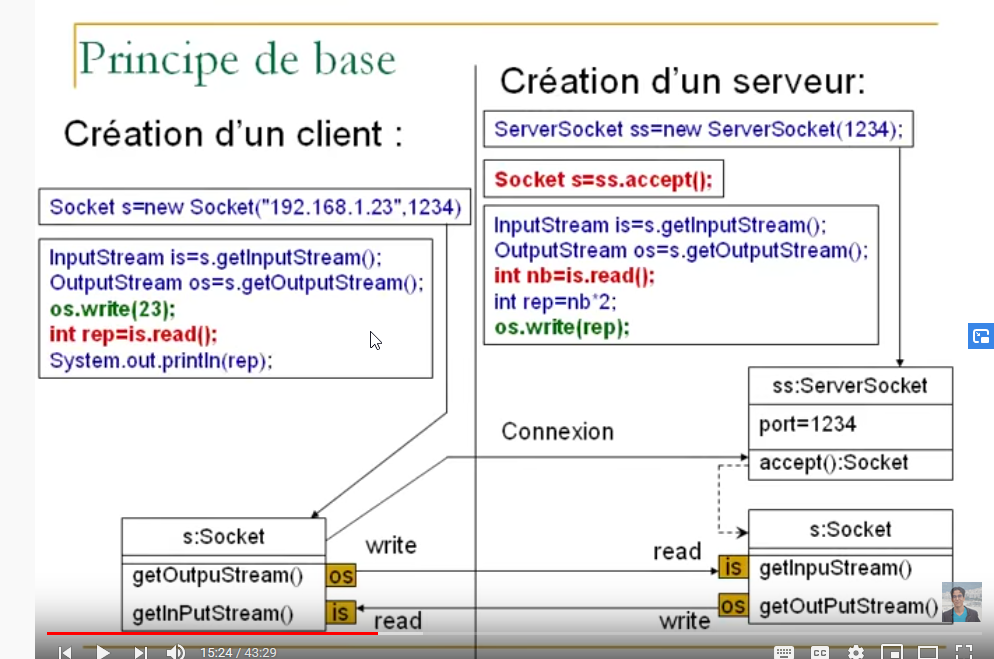

# Socket Multithread


## A)  Principe de base




## Configuration Server

Il faut hériter de la Class **Thread** et implémenter la Class **run**. A la connexion d'un client la méthode **main** créée un **In/Out** stream , puis démarre le thread avec la nouvelle socket et les flux stream in/out.  La Class **ClientHandler** sera en communication avec le client.

```java
// Java implementation of Server side 
// It contains two classes : Server and ClientHandler 
// Save file as Server.java 

import java.io.*; 
import java.text.*; 
import java.util.*; 
import java.net.*; 

// Server class 
public class Server 
{ 
	
	private static Integer PORT = 5056 ; 
	
	
	public static void main(String[] args) throws IOException 
	{ 
		
		// Number of clients connected
		Integer NbClientConnected = 0 ; 

		// server is listening on port 5056 
		ServerSocket ss = new ServerSocket(PORT); 
		
		// running infinite loop for getting 
		// client request 
		while (true) 
		{ 
			Socket s = null; 
			
			try
			{ 
				System.out.println("wait for new connection:...");
				// socket object to receive incoming client requests 
				// wait inaccept socket form new client
				s = ss.accept(); 
				
				// count number of clients
				++NbClientConnected ; 
				
				System.out.println("A new client is connected. Client number: " + NbClientConnected + " "+ s ); 
				
				// obtaining input and out streams 
				DataInputStream dis = new DataInputStream(s.getInputStream()); 
				DataOutputStream dos = new DataOutputStream(s.getOutputStream()); 
				
				System.out.println("Assigning new thread for this client"); 

				// create a new thread object 
				Thread t = new ClientHandler(s, dis, dos, NbClientConnected); 

				// Invoking the start() method 
				t.start(); 
				
			} 
			catch (Exception e){ 
				s.close(); 
				ss.close();
				e.printStackTrace(); 
			} 
		} 
	} 
} 

// ClientHandler class 
class ClientHandler extends Thread 
{ 
	DateFormat fordate = new SimpleDateFormat("yyyy/MM/dd"); 
	DateFormat fortime = new SimpleDateFormat("hh:mm:ss"); 
	final DataInputStream dis; 
	final DataOutputStream dos; 
	final Socket s; 
	private Integer  NbClientConnected ; 

	// Constructor 
	public ClientHandler(Socket s, DataInputStream dis, DataOutputStream dos, Integer NbClientConnected) 
	{ 
		this.s = s; 
		this.dis = dis; 
		this.dos = dos; 
		this.NbClientConnected = NbClientConnected ; 
	} 

	@Override
	public void run() 
	{ 
		String received; 
		String toreturn; 
		
		while (true) 
		{ 
			try { 

				 System.out.println("Client number: "+NbClientConnected);
				// Ask user what he wants 
				dos.writeUTF("What do you want?[Date | Time]..\n"+ 
							"Type Exit to terminate connection."); 
				
				// receive the answer from client 
				received = dis.readUTF(); 
				
				if(received.equals("Exit")) 
				{ 
					System.out.println("Client " + this.s + " sends exit..."); 
					System.out.println("Closing this connection."); 
					this.s.close(); 
					System.out.println("Connection closed"); 
					break; 
				} 
				
				// creating Date object 
				Date date = new Date(); 
				
				// write on output stream based on the 
				// answer from the client 
				switch (received) { 
				
					case "Date" : 
						toreturn = fordate.format(date); 
						dos.writeUTF(toreturn); 
						break; 
						
					case "Time" : 
						toreturn = fortime.format(date); 
						dos.writeUTF(toreturn); 
						break; 
						
					default: 
						dos.writeUTF("Invalid input"); 
						break; 
				} 
			} catch (IOException e) { 
				e.printStackTrace(); 
			} 
		} 
		
		try
		{ 
			// closing resources 
			this.dis.close(); 
			this.dos.close(); 
			
		}catch(IOException e){ 
			e.printStackTrace(); 
		} 
	} 
} 

```

## Configuration Client

```java
// Java implementation for a client 
// Save file as Client.java 

import java.io.*; 
import java.net.*; 
import java.util.Scanner; 


// Client class 
public class Client 
{ 
	public static void main(String[] args) throws IOException 
	{ 
		try
		{ 
			Scanner scn = new Scanner(System.in); 
			
			// getting localhost ip 
			InetAddress ip = InetAddress.getByName("localhost"); 
	
			// establish the connection with server port 5056 
			Socket s = new Socket(ip, 5056); 
	
			// obtaining input and out streams 
			DataInputStream dis = new DataInputStream(s.getInputStream()); 
			DataOutputStream dos = new DataOutputStream(s.getOutputStream()); 
	
			// the following loop performs the exchange of 
			// information between client and client handler 
			while (true) 
			{ 
				System.out.println(dis.readUTF()); 
				String tosend = scn.nextLine(); 
				dos.writeUTF(tosend); 
				
				// If client sends exit,close this connection 
				// and then break from the while loop 
				if(tosend.equals("Exit")) 
				{ 
					System.out.println("Closing this connection : " + s); 
					s.close(); 
					System.out.println("Connection closed"); 
					break; 
				} 
				
				// printing date or time as requested by client 
				String received = dis.readUTF(); 
				System.out.println(received); 
			} 
			
			// closing resources 
			scn.close(); 
			dis.close(); 
			dos.close(); 
		}catch(Exception e){ 
			e.printStackTrace(); 
			
		} 
	} 
} 

```
## C)  Run de l'application


Resultat Server

```bash
wait for new connection:...
A new client is connected. Client number: connected: 1 Socket[addr=/127.0.0.1,port=63986,localport=5056]
Assigning new thread for this client
wait for new connection:...
Client number: 1
A new client is connected. Client number: connected: 2 Socket[addr=/127.0.0.1,port=63998,localport=5056]
Assigning new thread for this client
wait for new connection:...
Client number: 2
Client number: 2
Client number: 2
Client number: 2
Client number: 2
Client number: 1
Client number: 1
```


Resultat **client 1**

```bash
What do you want?[Date | Time]..
Type Exit to terminate connection.
Time
06:09:06
What do you want?[Date | Time]..
Type Exit to terminate connection.
Time
06:09:08
What do you want?[Date | Time]..
Type Exit to terminate connection.
```

Ouvrir un nouveau client 2
Résultat  **client2**

```bash
What do you want?[Date | Time]..
Type Exit to terminate connection.
Date
2020/03/31
What do you want?[Date | Time]..
Type Exit to terminate connection.
dfd
Invalid input
What do you want?[Date | Time]..
Type Exit to terminate connection.
Date
2020/03/31
What do you want?[Date | Time]..
Type Exit to terminate connection.
Date
2020/03/31
What do you want?[Date | Time]..
Type Exit to terminate connection.
```


